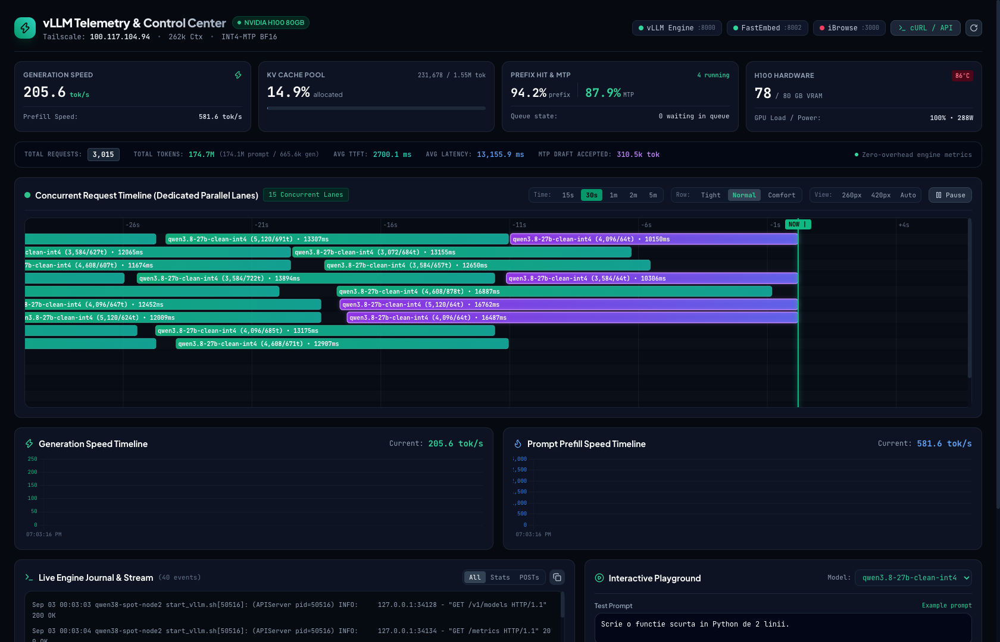

# ⚡ vLLM UI & Telemetry Dashboard

Zero-dependency, real-time **Vue 3 Web UI & Telemetry Dashboard** for **vLLM** and local LLM inference engines.

Provides live GPU utilization, token throughput timelines (Prompt & Generation tok/s), dedicated **Concurrent Request Waterfall (Streaming Timeline)**, lifetime Prometheus counters (Total Requests, Prompt/Gen Tokens, TTFT, Latency), KV Cache memory pool visualizer, Prefix Cache hit rates, Speculative Decoding (MTP) metrics, live engine journal logs, and an interactive prompt playground.

---

<p align="center">
  
</p>

---

## 🚀 1-Command Instant Run

### Option 1: Standalone 1-Liner (Zero Install)
```bash
curl -fsSL https://raw.githubusercontent.com/AndrianBalanescu/vllm-ui/main/vllm_ui/server.py | python3 -
```

### Option 2: Clone & Run
```bash
git clone https://github.com/AndrianBalanescu/vllm-ui.git
cd vllm-ui
python3 vllm_ui/server.py --port 8080 --vllm-url http://127.0.0.1:8000
```

### Option 3: Local Pip Install
```bash
pip install -e .
vllm-ui --port 8080 --vllm-url http://127.0.0.1:8000
```

---

## 🌟 Key Features

- ⚡ **Concurrent Request Waterfall (Streaming Timeline)**: 60 FPS HTML5 Canvas ticker streaming from the `NOW |` marker leftward into history. Clean dedicated parallel lanes without row overlaps, interactive zoom (`15s` to `5m`), row height density (`Tight 14px`, `Normal 18px`, `Comfort 26px`), and hover inspection tooltips (Tokens I/O, TTFT, Duration ms, Speed tok/s).
- 📊 **Dual Split Throughput Timelines**: Dedicated independent auto-scaling charts for **Generation Speed** (`0..300+ tok/s`) and **Prompt Prefill Speed** (`0..8000+ tok/s`).
- 📈 **Lifetime Zero-Overhead Metrics Strip**: Direct extraction from vLLM's internal Prometheus counters — Total Requests processed, Total Prompt & Generated Tokens, Average TTFT, Average E2E Latency, and MTP Draft acceptance rates.
- 🧠 **KV Cache Memory Pool**: Visual progress bar tracking allocated vs. total KV token slots (e.g. 1.55M tokens).
- 🎯 **Prefix Cache & Speculative Decoding**: Live tracking of Prefix Cache hit percentage and Multi-Token Prediction (MTP) draft acceptance rates.
- 🖥️ **NVIDIA GPU Telemetry**: Live VRAM allocation, GPU core load %, temperature (°C), and power draw (W).
- 📜 **Live Engine Journal**: Real-time auto-scrolling log stream with quick filters (`All`, `Stats`, `POSTs`) and 1-click clipboard export.
- 🧪 **Interactive Speed Playground**: Test inference latency, TTFT, and single-stream tok/s speedometers directly in the browser.
- 📋 **1-Click cURL & OpenAI API Snippets**: Auto-generates ready-to-run cURL commands for any active model in `/v1/models`.

---

## 🛠️ CLI Options

```text
usage: vllm-ui [-h] [--port PORT] [--host HOST] [--vllm-url VLLM_URL] [--api-key API_KEY]

options:
  -h, --help            show this help message and exit
  --port PORT, -p PORT  Dashboard port (default: 8080)
  --host HOST, -H HOST  Dashboard host (default: 0.0.0.0)
  --vllm-url VLLM_URL   vLLM base URL (default: http://127.0.0.1:8000)
  --api-key API_KEY     vLLM API Key (if required)
```

---

## 📄 License
MIT © Andrian Balanescu
